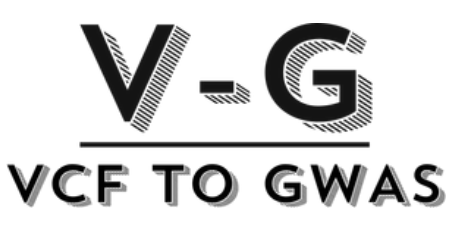

<!-- README.md is generated from README.Rmd. Please edit that file -->

# VCFtoGWAS 
This package was built to assist in opening VCF files in R (based on the [vcfR](https://knausb.github.io/vcfR_documentation/) package) and then processing the data to get a GWAS matrix and execute the GWAS and analyze the results. 
It was not built as a wide tool to assist everyone but rather be a usefull tool for a specific dataset. Though it can be used for other datasets, more work and/or thought might be needed. 

The complete instructional website can be found at: https://tomerantman.github.io/VCFtoGWAS/

### Installing:
``` r
# Install development version from GitHub
devtools::install_github("TomerAntman/VCFtoGWAS")
```


